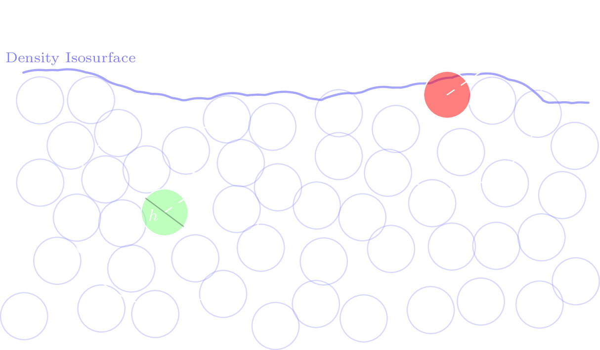

# Motivation {background-video="res/coast-cut.mp4" background-video-loop="true" background-video-muted="true" auto-animate=true}

<style>
  /* :root{--r-link-color:white !important;} */
  .aside-footnotes{opacity:0.5; font-size:14pt;}  
  .boxed{margin: 50px;
  border: white 1px solid;
  display: flex;
  justify-content: center;
  align-items: center;
  border-radius: 10px;}

  .fragment.glow{filter: drop-shadow(0px 0px 10px #23cbfa00); transition: all 500ms ease;}
  .fragment.glow.visible{filter: drop-shadow(0px 0px 10px #23cafa); transition: all 500ms ease;}
  .fragment.glow > span.comment {opacity:0;}
  .fragment.glow.visible > span.comment {opacity:1;}
  .comment{
    position: absolute;
    bottom: -150px;
    left: 50%;
    transform: translateX(-50%);
  }
  .spacer{margin-top:100px;}
</style>

## Lagrangian Hydrodynamics {auto-animate=true}

- System State: $\vec{x}_1,\dots,\vec{x}_N$ and $\vec{v}_1,\dots,\vec{v}_N$ at current time $t$
- Given: $\vec{g}, m, \nu, N$
- Decision variables: $p_1,\dots, p_N$
- Governing equations:

<div data-id="ns">
<span data-id="ns-g">$\ddot{\vec{x}}_i = \vec{g}$</span> <span data-id="ns-nu">$+\nu \nabla^2 \vec{v}_i$</span> <span data-id="ns-p"> $\underbrace{- \frac{1}{\rho_i}\nabla p_i}_{\text{Pressure Acceleration}}$ </span> 
</div>

<!-- $\vec{v}(t+\Delta t) = \vec{v}_i + \ddot{\vec{x}}_i \cdot \Delta t$

$\vec{x}(t+\Delta t) = \vec{x}_i + \vec{v}_i \cdot \Delta t$ -->

<div data-id="dencon">
subject to <span data-id="drho-dt">$\frac{D\rho_i(\vec{x}_1,\dots,\vec{x}_N)}{Dt} = 0$</span> 
</div>

## Discretization {auto-animate=true}
<!-- continuous -->

- Governing equations:

<div data-id="ns">
$\ddot{\vec{x}}_i = \vec{g}+\nu \nabla^2 \vec{v}_i- \frac{1}{\rho_i}\nabla p_i$
</div>

<div data-id="dencon">
$\frac{D\rho_i(\vec{x}_1,\dots,\vec{x}_N)}{Dt} = 0$
</div>

## Discretization {auto-animate=true}
<!-- discrete time -->

- Governing equations:

<div data-id="ns">
$\ddot{\vec{x}}_i = \vec{g}+ \langle\nu \nabla^2 \vec{v}_i\rangle- \frac{1}{\langle\rho_i\rangle}\langle\nabla p_i\rangle$ 
</div>

<div data-id="dencon">
$\left\langle\rho_i\left(\begin{array}{c}
\vec{x}_1(t+\Delta t)\\\dots\\\vec{x}_N(t+\Delta t)
\end{array}\right)\right\rangle = \rho_0$
</div>


::: {.fragment}
<div class="spacer"></div>
<div data-id="drho-dt">
- Semi-implicit Euler Time Integration

$\begin{align}
\vec{v}_i(t+\Delta t) &= \vec{v}_i + \ddot{\vec{x}}_i \cdot \Delta t\\
\vec{x}_i(t+\Delta t) &= \vec{x}_i + \vec{v}_i(t+\Delta t) \cdot \Delta t
\end{align}$
</div> 
:::
## Smoothed Particle Hydrodynamics {auto-animate=true}


<!-- $\begin{align}A(\vec{x}_i) &= \int_\Omega &A(\vec{x}_j) \delta(\vec{x}_j - \vec{x})  \,dV\\A_i &\approx \sum_{j \in \mathcal{N}_i} \frac{m_j}{\rho_j} &A_j  W(\vec{x}_i - \vec{x}_j, \hbar)\end{align}$ -->

<!-- - $A(\vec{x}_i) = \int_\Omega A(\vec{x}_j) \delta(\vec{x}_j - \vec{x})  dV$ -->
<div style= "font-size: 14pt;">
$\begin{align}
\langle f_i\rangle &= \sum_{j \in \mathcal{N}_i} \frac{m}{\rho_j} \, f_j \, W_{ij}\qquad
\langle\nabla f_i\rangle = \rho_i \sum_{j \in \mathcal{N}_i} m \, \left( \frac{f_i}{\rho_i^2} + \frac{f_j}{\rho_j^2} \right) \, \nabla W_{ij}\qquad
\langle \nabla \cdot \vec{f}_i \rangle = -\frac{1}{\rho_i} \sum_{j \in \mathcal{N}_i} m \left(\vec{f}_i - \vec{f}_j\right) \cdot \nabla W_{ij}
\end{align}$ 
</div>

<!-- $\begin{align}A(\vec{x}_i) &\approx \sum_{j \in \mathcal{N}_i} V_j A_j W(\vec{x}_{ij}, \hbar)\\\nabla A(\vec{x}_i) &\approx \sum_{j \in \mathcal{N}_i} V_j A_j \nabla W(\vec{x}_{ij}, \hbar)\end{align}$

- Sum over neighbours $\mathcal{N}_i := \left\{\vec{x} : \, \left|\left|\vec{x}_i-\vec{x}\right|\right|_2 \leq \hbar\,  \right\}$ -->
- <span style="font-size:16pt;">2D Gaussian Kernel^[SPH Tutorial, Koshier et al. 2019] such as $W_{ij} := W(\vec{x}_i - \vec{x}_j, \hbar) = \frac{16}{\pi\hbar^2}\cdot \max\left(0,1-\frac{\left|\vec{x}_i-\vec{x}_j\right|}{\hbar}\right)^3 - 4\cdot \max\left(0,\frac{1}{2} - \frac{\left|\vec{x}_i-\vec{x}_j\right|}{\hbar}\right)^3$</span>

<div style="display: flex; justify-content: center; align-items: center; flex-direction: column;">
<div style="display: flex; justify-content: center; align-items: center; flex-direction: row;">
<canvas id="smooth_canv" width="500" height="300" style="border:1px solid #444;"></canvas>
<canvas id="kernel_canv" width="500" height="300" style="border:1px solid #444; margin-left:50px;"></canvas>
</div>
<br/>
<div style="display: flex; font-size:14pt; margin-top:20px;"> $\hbar$ <span style="width:20px"></span><input type="range" id="smoothing_length" min="5" max="300" value="10"></div>
</div>

```{=html}
<script>
  const canvas = document.getElementById('smooth_canv');
  const ctx = canvas.getContext('2d');
  const slider = document.getElementById('smoothing_length');

  const particle_img = new Image();
  particle_img.src = './res/sph-alpha-low.png';

  particles = []
  particle_img.onload = () => {
    particles.push([0.5,0.5])
    draw_particles();
    draw_kernel();
  };
  slider.addEventListener('input', () => {
    draw_particles();
    draw_kernel();
  }); 
  canvas.addEventListener('click', evt => {
    // get click pos relative to canvas
    const rect = canvas.getBoundingClientRect();
    const x = (evt.clientX - rect.left) / rect.width;
    const y = (evt.clientY - rect.top ) / rect.height;
    particles.push([x,y]);
    draw_particles()
  });
  document.addEventListener("keydown", (event) => {
    if (event.key.toLowerCase() === ",") {
      particles=[];
      draw_particles()
    }
  });

  function draw_kernel(){
    W = (q)=> Math.pow(Math.max(1-q,0), 3) - 4*Math.pow(Math.max(0.5-q,0), 3)
    const w = canvas.width, h = canvas.height;
    const ctx = document.getElementById('kernel_canv').getContext('2d');
    ctx.clearRect(0, 0, w, h);
    const size = (+slider.value)/300;
    ctx.strokeStyle = "#ddd";
    ctx.beginPath();
    ctx.moveTo(0,4*h/5);
    for (let x=0; x<w; x+=2){
      f_x = -W(Math.abs((x-0.5*w)/(w*0.6*size)))/0.8*h+4*h/5
      ctx.lineTo(x, f_x);
    }
    ctx.stroke();
  }

  function draw_particles() {
    const w = canvas.width, h = canvas.height;
    const size = +slider.value;
    ctx.clearRect(0, 0, w, h);
    for (let i=0; i<particles.length; i+=1){
      const px = particles[i][0] * w;
      const py = particles[i][1] * h;
      ctx.drawImage(
        particle_img,
        px - size/2,   // top-left x
        py - size/2,   // top-left y
        size,          // draw width
        size           // draw height
      );
    }
  }
  
</script>
```


## Discretization {auto-animate=true}
<!-- discrete time -->

- Governing equations:

<div data-id="ns">
$\ddot{\vec{x}}_i = \vec{g}+ \langle\nu \nabla^2 \vec{v}_i\rangle- \frac{1}{\langle\rho_i\rangle}\langle\nabla p_i\rangle$ 
</div>

<div data-id="dencon">
$\left\langle\rho_i\left(\begin{array}{c}
\vec{x}_1(t+\Delta t)\\\dots\\\vec{x}_N(t+\Delta t)
\end{array}\right)\right\rangle = \rho_0$
</div>

::: {.fragment}
<div class="spacer"></div>
<div data-id="drho-dt">
$\left\langle\rho_i\right\rangle + \Delta t \left\langle \frac{D\rho_i}{Dt} \right\rangle = \rho_0$
</div> 
:::

<div class="spacer"></div>


## Discretization {auto-animate=true}

- Governing equations:

<div data-id="ns">
$\ddot{\vec{x}}_i = \vec{g}+ \langle\nu \nabla^2 \vec{v}_i\rangle- \frac{1}{\langle\rho_i\rangle}\langle\nabla p_i\rangle$
</div>

<div data-id="drho-dt">
<span class="fragment custom glow"> $\langle\rho_i \rangle\underbrace{-\Delta t \langle\rho_i\rangle \left\langle\nabla \cdot \left(\vec{v}_i +\Delta t \vec{g} + \Delta t \langle\nu \nabla^2\vec{v}_i\rangle\right)\right\rangle}_{\Delta \rho_i^{g,\nu}}$<span class="comment">$\rho_i^*:=$</span></span>$+ \underbrace{\Delta t^2 \langle \nabla^2 p_i \rangle}_{\Delta \rho_i^{p}} = \rho_0$
</div> 


## Discretization {auto-animate=true}

- Governing equations:

<div data-id="ns">
$\ddot{\vec{x}}_i = \vec{g}+ \langle\nu \nabla^2 \vec{v}_i\rangle- \frac{1}{\langle\rho_i\rangle}\langle\nabla p_i\rangle$
</div>


<div data-id="drho-dt">
$\rho_i^*+ \Delta t^2 \langle \nabla^2 p_i \rangle = \rho_0$
</div> 


## Particle Deficiency {auto-animate=true}

{height=400}

- Positivity constraint $p_i \geq 0$
- Incompressibility constraint $\rho_i^*+ \Delta t^2 \langle \nabla^2 p_i \rangle \leq \rho_0$

<!-- ## Linearizing the constraint {auto-animate=true}
- Incompressibility constraint $\rho_i^*+ \Delta t^2 \langle \nabla^2 p_i \rangle \leq \rho_0$

$\rho_i(t+\Delta t) \approx \rho_i(t) + \frac{D\rho_i}{D t} \Delta t$

::: {.fragment}
$\rho_i^*(t) \quad\quad\,\,= \rho_i(t) - \rho_i(t) \nabla \cdot(\vec{v}^*_i + \Delta t \vec{a}^p_i) \Delta t$
:::

::: {.fragment}

- Linearized Incompressibility Constraint $\rho_i^*(t) - \rho_0 \leq \epsilon$
::: -->

## Formulating an Optimization Problem {auto-animate=true}

- Positivity constraint $p_i \geq 0$
- Incompressibility constraint $\rho_i^*+ \Delta t^2 \langle \nabla^2 p_i \rangle \leq \rho_0$
- $\Longrightarrow$ Explosions are feasible


## Formulating an Optimization Problem {auto-animate=true}
- Idea: Minimize Action

$\begin{align}S(\vec{p}) &= \frac{1}{2}\sum_i \left|\left|\, \vec{a}^p_i \,\right|\right|_2^2 \quad\propto \sum_i \langle\nabla p_i\rangle \cdot \langle\nabla p_i\rangle \\ S_i (\vec{p})&:= \left(\rho_i \sum_{j \in \mathcal{N}_i} m_j \, \left( \frac{p_i}{\rho_i^2} + \frac{p_j}{\rho_j^2} \right) \, \nabla W_{ij}\right)^2\end{align}$ 

  - Gauss' principle: minimize Action subject to constraints.^[PMPG: Alhussein & Daqaq 2024]

## Formulating an Optimization Problem {auto-animate=true}

<div style="margin: 50px;
  border: white 1px solid;
  display: flex;
  flex-direction:column;
  justify-content: center;
  align-items: center;
  border-radius: 10px;">

$\begin{align}
&\min_{\vec{p}\in ℝ^N} &\frac{1}{2}\sum_i \left(\rho_i \sum_{j \in \mathcal{N}_i} m_j \, \left( \frac{p_i}{\rho_i^2} + \frac{p_j}{\rho_j^2} \right) \, \nabla W_{ij}\right)^2
\end{align}$

$\begin{align}
&\text{s.t.}&\forall i\in\{1,\dots,N\}: &\quad p_i \geq 0 \\
&&\forall i\in\{1,\dots,N\}: &\quad \langle\rho^*_i\rangle - \rho_0 \leq \epsilon \\
\end{align}$
</div>

- This is a convex Quadratic Program with a Least Squares objective
  - Objective is quadratic in $\vec{p}$ with positive semidefinite Hessian
  - $p_i \geq 0$ is linear in $\vec{p}$
  - $\langle\rho^*_i\rangle - \rho_0$ is affine in $\vec{p}$

## Results {auto-animate=true}
- The fluid solver was implemented in Python using CasADi


<!-- - $\begin{align}\nabla p_i \approx \rho_i \sum_{j \in \mathcal{N}_i} m_j \, \left( \frac{p_i}{\rho_i^2} + \frac{p_j}{\rho_j^2} \right) \, \nabla W_{ij}\end{align}$^[SPH Tutorial, Koshier et al. 2019] -->